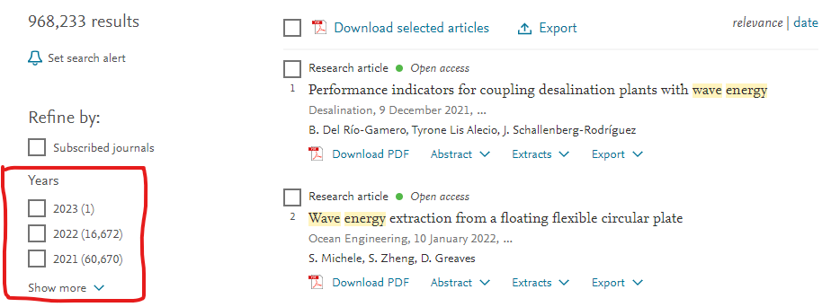
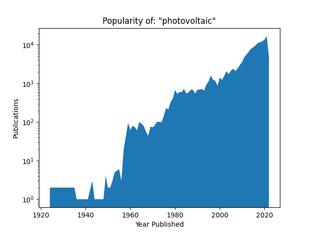

# Paper Popularity

The idea behind this project is to enable researchers to explore current trends in research fields via the metric of publications.

Currently it is a command line application which makes a query to [Science Direct](https://sciencedirect.com) and scrapes the number of papers per year inside the red outline below. The page is limited to showing 25 items, so the date on the query is adjusted to collect all existing years far back as they are recorded with minimal strain on the website.



## Installation

I haven't published to PyPi but it can be easily installed locally.
``` shell
pip install -e C:\\directory_package_is_in\paper_popularity
```

## Usage

``` python
import paper_popularity

# Initiate main script
paper_popularity.main()
```

When ran, the script will output a prompt such as:

``` shell
[Hit enter to exit]
Search for:
```

Entering a query will return a figure like below:



Once finished, the following query will appear:

``` shell
[Hit enter to exit]
change y scale ['linear, log']:
```

If "Linear" or "Log" is entered, the scale of the y-axis will be changed accordingly.

## Roadmap
In time I plan to add the following

* Execute handling of data retrieval in a parallel thread or processor so that the figures don't get frozen.
* Implement a GUI that allows for searching and managing figures.
    * Advanced search option to specify date ranges, author names, affiliations, etc.
    * Toggles for scale of y-axis.
    
## Expected Issues

Running from command line in a virtual environment yields no issues. But figures usually become frozen when ran in PyCharm

## Notes

This application was developed on Windows and hasn't been tested on other platforms.
